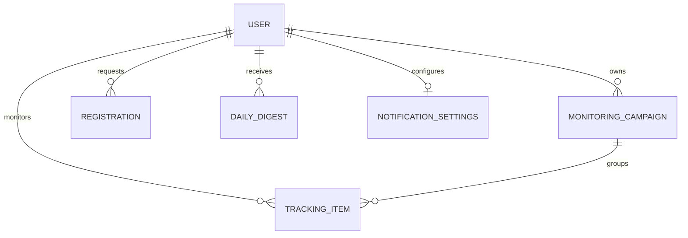

# 콘텐츠 모니터링 API 스펙

> **⚠️ 사본(스냅샷)** — 정본은 celfit-front 리포의 `docs/api-spec.md` 6.25~6.33 (2차 개정, 2026-07-29).
> 이 파일은 was 쪽 구현이 참조하는 시점의 스냅샷이며, 정본이 갱신되면 이 사본도 교체한다.
> 원본의 절 번호(6.25~6.33)를 그대로 유지한다. 함께 볼 문서:
> [specs/2026-07-29-monitoring-v3-backend-request.md](../superpowers/specs/2026-07-29-monitoring-v3-backend-request.md)(구현 요청 브리프),
> [monitoring-was-contract.md](monitoring-was-contract.md)(monitoring 모듈 계약 v1.0).

hypenow의 콘텐츠 모니터링·알림 기능을 위한 백엔드 API 계약 문서. 프론트 구현이 완료된 상태에서 화면이 실제로 요구하는 것을 역산해 작성했다.

- 작성일 2026-07-29 / 대상 독자: 백엔드(Java/Spring) 개발자와 구현 에이전트
- 이 문서는 **모니터링 기능만** 다룬다. hypenow의 다른 API(리더보드, 인플루언서 발굴, 저장 목록, 인증 등)는 이미 구현돼 운영 중이며 이 문서의 범위가 아니다. 그쪽 코드는 손대지 않는다.
- 절 번호는 마스터 문서 `api-spec.md`와 같게 유지했다(6.25~6.33). 나중에 원본과 대조하기 위해서다.

## 0. 이 문서 읽는 법

| 태그 | 의미 |
|---|---|
| `[제안]` | 프론트가 필요해서 제안한 필드·동작. 반대 없으면 채택 |
| `[확인 필요]` | 데이터 파이프라인이 실제로 제공 가능한지 백엔드 확인이 필요한 항목 |

태그 없는 필드는 프론트가 실제로 소비하고 있으므로 구현 대상이다.

**함께 볼 문서**: `monitoring-backend-request.md`에 기존 DB 자산 중 무엇을 재사용하는지, 신규 테이블 제안, 구현 우선순위, 아직 사람이 결정해야 하는 항목이 정리돼 있다.

## 1. 공통 규약

이 절의 규칙은 **모니터링 도메인(6.25~6.33)에만** 적용한다. 기존 엔드포인트의 직렬화나 응답 형태를 바꾸는 근거로 쓰지 않는다.

### 1.1 개요

| 항목 | 값 |
|---|---|
| Base URL | `https://api.hypenow.io` |
| 버저닝 | URL prefix `/v1` |
| 프로토콜 | HTTPS only |
| 요청·응답 본문 | JSON (UTF-8) |
| 인증 | 세션 쿠키(프론트는 `credentials: "include"`로 호출). 모니터링 엔드포인트는 전부 로그인 필수이며 응답은 로그인 유저 소유 데이터로 격리한다 |

### 1.2 응답 envelope

모든 응답은 아래 형태로 감싼다. HTTP 204(본문 없음)는 예외다.

성공:

```json
{
  "success": true,
  "data": { },
  "error": null,
  "meta": { "total": 12 }
}
```

실패:

```json
{
  "success": false,
  "data": null,
  "error": { "code": "NOT_FOUND", "message": "콘텐츠를 찾을 수 없습니다." }
}
```

- `meta`는 목록 응답에만 포함한다.
- `error.message`는 유저에게 그대로 노출 가능한 한국어 문장으로 쓴다. 프론트가 이 문장을 그대로 화면에 띄운다.
- **nullable 필드는 키를 생략하지 말고 명시적 `null`로 직렬화한다.** 프론트에 런타임 스키마 검증이 없어 키가 빠지면 `undefined !== null` 비교가 참이 되어 조용히 반대로 동작한다. 실제 사례: 알림의 `readAt`을 생략하면 모든 알림이 읽음으로 처리돼 안읽음 배지가 영구히 0이 되고, 에러도 로그도 남지 않는다. Jackson의 `NON_NULL` 설정을 이 도메인에 적용하지 마라.

### 1.3 에러 코드

| HTTP | code | message 예시 | 발생 상황 |
|---|---|---|---|
| 400 | VALIDATION_FAILED | 올바른 형식이 아니에요. | 파라미터·본문 형식, enum, 필수값, 범위 위반 |
| 401 | UNAUTHORIZED | 로그인이 필요합니다. | 비로그인 접근, 세션 만료 |
| 403 | FORBIDDEN | 접근 권한이 없습니다. | 타 유저 소유 리소스 접근 |
| 404 | NOT_FOUND | 대상을 찾을 수 없습니다. | 존재하지 않는 itemId·campaignId |
| 409 | CAMPAIGN_NAME_EXISTS | 같은 이름의 캠페인이 이미 있어요. | 캠페인 생성·이름 변경 시 이름 중복 |
| 500 | INTERNAL_ERROR | 일시적인 오류가 발생했어요. | 서버 내부 오류 |
| 503 | SERVICE_UNAVAILABLE | 일시적으로 연결이 어려워요. 잠시 후 다시 시도해 주세요. | 일시적 장애·점검. 읽기 요청은 재시도 가능하며 `Retry-After` 헤더를 함께 보낸다 |

### 1.4 목록과 meta

- 모니터링 목록은 유저 소유 데이터를 **전량 반환**한다. `limit` 쿼리 파라미터를 받지 않는다. 필터·검색·정렬·건수 집계는 전부 프론트가 한다.
- 예외적으로 건수 상한이 있는 목록이 둘 있다: 등록 처리 내역(최근 50건), 알림 다이제스트(최근 30건). 이 둘만 `meta.total > data.length`가 나올 수 있다.
- 전량 반환 목록은 `meta.total === data.length`가 항상 성립해야 한다. 프론트가 상태별 건수를 `meta.total`이 아니라 배열 길이로 집계하므로, 둘이 어긋나면 한 화면 안에서 숫자가 갈린다.

### 1.5 날짜·시간 포맷

| 종류 | 포맷 | 예시 | 사용 필드 |
|---|---|---|---|
| 타임스탬프 | ISO 8601, **KST 오프셋** | `2026-07-29T09:00:00+09:00` | createdAt, nextCheckAt, requestedAt, readAt 등 |
| 날짜 전용 | `YYYY-MM-DD` | `2026-07-29` | registeredAt, uploadedAt, hiddenAt, snapshots[].date 등 |

이 서비스의 모든 시각 개념(배치, 알림, 등록일, 기간 계산)이 한국 시각 기준이라 UTC가 아니라 KST 오프셋으로 직렬화한다. 프론트는 오프셋이 포함된 벽시계 값을 그대로 표시한다.

### 1.6 네이밍

- JSON 필드는 camelCase. Spring에서 Jackson 기본 전략이 camelCase이므로 DTO 필드명을 camelCase로 선언하면 된다(snake_case 전략 설정을 넣지 말 것).
- ID는 문자열이다. 형식은 자유이나 **`TrackingItem.id`는 URL 쿼리 파라미터에 인코딩 없이 조립되므로**(`/monitoring/contents-list?item=<id>`) `^[A-Za-z0-9_-]+$` 범위 안에서 발급한다. 이 범위를 벗어나면 딥링크가 다른 행을 가리키거나 아무것도 못 찾는다.

### 1.7 enum 확장 규약

enum 필드(`status`, 알림 `type`, 알림 `category`)에 **신규 값을 도입할 때는 프론트 배포가 선행돼야 한다.** 프론트는 알려진 값만 매핑하고 있어 미지 값을 만나면 화면이 깨진다: 상태값은 어느 탭에도 걸리지 않아 카드가 조용히 사라지고, 알림 유형은 매핑 조회에 실패해 대시보드 전체가 오류 화면으로 교체된다. 값 추가는 백엔드 단독 배포로 켜지 말고, 프론트 대응 배포가 끝난 뒤에 켠다.

### 1.8 계약 무결성 규칙

프론트에 런타임 스키마 검증이 없어 응답 형태 위반이 파싱 단계에서 잡히지 않는다. 아래 다섯 가지는 어기면 **에러 없이 화면이 조용히 잘못 동작한다.**

| # | 규칙 | 어기면 생기는 일 |
|---|---|---|
| 1 | nullable 필드는 명시적 `null`(1.2) | 알림 `readAt` 생략 시 전 알림이 읽음 처리되고 배지가 영구히 0 |
| 2 | enum 신규 값은 프론트 배포 선행(1.7) | 대시보드 전체가 오류 화면으로 교체되거나 카드가 사라짐 |
| 3 | `campaignId`가 값이면 캠페인 목록 응답에 반드시 존재 | 유령 캠페인 카드(소속 콘텐츠 0건, 지표 전부 `-`, 클릭하면 빈 상세) |
| 4 | 응답 `handle`은 소문자 정규화 | 등록 화면의 중복 안내 배지가 조용히 사라짐 |
| 5 | `meta.lastCollectedAt`은 마지막으로 **성공한** 배치 완료 시각 | 부분 수집 중 조회 시 서로 다른 날짜의 증가분이 하루 종일 섞여 합산됨 |

## 2. 도메인 모델

### 2.1 엔티티

| 엔티티 | 핵심 필드 | 비고 |
|---|---|---|
| TrackingItem | 6.25 필드 표 참조 | 유저 소유 모니터링 추적 행. TrackedPost·Snapshot·PostComment를 내장 |
| MonitoringCampaign | id, userId, name(유저 내 유니크), description, startDate, endDate, brand, budget, createdAt | 6.25 Campaign 표 |
| Registration | id, userId, requestedAt, completedAt, entries[] | 등록 처리 내역(6.28) |
| DailyDigest | id, userId, date, createdAt, readAt, items[] | 알림 다이제스트(6.32). (userId, date) 유니크 |
| NotificationSettings | userId, 설정 JSON | 6.33. 유저당 1행, lazy 생성 |

### 2.2 관계도



## 3. 도메인 규약과 엔드포인트

아래 절 번호(6.25~6.33)는 마스터 문서 `api-spec.md`와 동일하게 유지했다. 나중에 원본과 대조하기 위해서다.

### 6.25 콘텐츠 모니터링: 공통 규약과 도메인 모델

`/monitoring` 화면군(전체 리스트, 캠페인, 콘텐츠 트래킹 리스트)과 사이드바 알림의 계약. 인증: 전부 Required이며 모든 리소스는 로그인 유저 소유로 격리된다(타 유저 리소스 접근 시 403). 원본 근거: `src/lib/monitoring/types.ts`(DTO 원형), `src/lib/monitoring/store.tsx`(액션), `src/lib/monitoring/notifications.ts`(알림 DTO), `src/lib/monitoring/parse.ts`(입력 정규화).

#### 수집 파이프라인 규약 (시각은 전부 KST)

| 시점 | 동작 |
|---|---|
| 등록 직후 | 접수된 항목만 1회 즉시 확인(비동기, 수 분 내). 게시물 링크는 메타·첫 스냅샷 생성, 계정은 프로필 메타 수집 |
| 매일 새벽 2시 | 통합 배치: 모니터링 중(tracking) 게시물 스냅샷 적재, 감지 중 계정의 신규 업로드 감지(키워드 매칭), 게시물 숨김/비공개 감지, 기간 만료 처리 |
| 매일 오전 9시 | **같은 날 새벽 2시 배치**의 결과로 알림 다이제스트 생성 + 이메일 발송(6.32) |

`nextCheckAt`은 서버가 계산해 내려주는 다음 배치 예정 시각이다(등록 직후에는 즉시 확인 예정 시각).

직렬화 주의: 타임스탬프 필드(createdAt, nextCheckAt, requestedAt 등)는 KST 오프셋을 명시한 ISO 8601(`2026-07-29T09:00:00+09:00`)로 직렬화한다(1.5절). UTC(Z)로 내리면 프론트가 9시간 어긋난 시각을 표시한다.

감지 규칙 보충: 계정 감지에는 감지 조건(keywords)이 항상 필요하다(and·or 합쳐 최소 1개, 6.27). 조건 없는 계정 등록은 존재하지 않는다. **같은 유저의** 진행 중인 다른 행(collecting/tracking 등)이 추적하는 게시물 URL은 감지 후보에서 제외한다(같은 게시물의 이중 추적 방지). 유저 스코프를 빼고 전역으로 구현하면 다른 유저가 먼저 추적 중인 게시물이 내 감지에서 조용히 빠진다(브랜드와 대행사가 같은 인플루언서를 시딩하는 정상 시나리오다). 동일 게시물을 여러 유저가 추적하면 수집은 1회만 하고, 각 유저에게 각자의 기간으로 노출한다.

배치 실패·지연 계약:

- 다이제스트는 이벤트가 0건이면 생성하지 않으므로(6.32) 알림만으로는 "변화 없음"과 "배치 실패"가 화면에서 구분되지 않는다. 이 구분은 `meta.lastCollectedAt`(6.26)으로 표현한다.
- `meta.lastCollectedAt`은 **마지막으로 성공한 배치의 완료 시각**이다. 실패하거나 중단된 배치는 이 값을 갱신하지 않는다.
- `content_issue` 이벤트는 **재시도가 소진된 뒤에만** 발화한다. 일시적 타임아웃·차단으로 전 유저에게 "게시물에 문제가 있어요" 알림이 나가는 것을 막는다.
- 배치가 9시 이후에 끝나면 **늦게라도 그날 발송한다**(배치 완료 직후). 건너뛰면 그날 변화가 영영 알려지지 않고, 다음 날로 합산하면 알림 하나에 이틀치가 섞여 `date`의 의미가 깨진다.

#### 지표 규약

모니터링 파이프라인은 6종 지표(views/likes/comments/saves/shares/reposts)를 수집한다. 게시물 유형에 따라 구조적으로 제공되지 않는 지표는 항상 `null`이고, 제공되는 지표도 비공개 설정 등으로 값이 없을 수 있다. UI는 null을 "-"로 표기하고 집계 모수에서도 제외한다. **`0`은 "실제로 0"만 의미한다.** 값이 없다는 뜻으로 0을 쓰면 참여율 같은 파생 지표가 왜곡된다.

유형별 제공 매트릭스(프론트의 "오늘의 성과" 집계가 이 전제로 모수를 나눈다. 0으로 채워 내리면 참여율이 왜곡되므로 반드시 null로 내려야 한다):

| 지표 | 릴스 | 피드 |
|---|---|---|
| views, shares, reposts | 제공 | **항상 null** |
| likes, comments, saves | 제공 | 제공 |

#### 상태 머신 (status, 서버 계산)

감지된 게시물에 대한 유저 승인 단계는 없다. 조건에 맞는 게시물이 감지되면 그대로 수집을 시작한다(2026-07-29 결정, 구 `pending_review` 상태와 승인·거절 액션 폐기).

| status | 라벨(참고) | 의미 |
|---|---|---|
| collecting | 게시물 확인 중 | 첫 수집 완료 전. 두 경로가 있다: 링크 등록 직후, 계정 감지 직후 |
| detecting | 업로드 감지 중 | 계정 등록 후 조건에 맞는 업로드 대기 |
| tracking | 모니터링 중 | 게시물 지표 적재 중 |
| not_uploaded | 미업로드 | 기간 내 업로드 없이 종결 |
| ended | 종료 | 모니터링 기간 만료로 종결 |
| hidden | 숨김 | 게시물이 비공개로 바뀌거나 삭제됨(인플루언서 쪽 원인). 스냅샷은 마지막 값 보존 |
| error | 오류 | **우리 쪽 수집 오류로 지표를 쌓지 못하는 상태**(내부 장애, 재시도 소진). 게시물은 정상인데 우리가 못 가져오는 경우다. 스냅샷은 마지막 값 보존 |

전이 규칙:

```
게시물 링크 등록 → collecting → (첫 수집 성공) → tracking → (기간 만료) → ended
                       └ (첫 수집 실패) → 행 삭제, 처리 내역에만 실패 기록(6.28)
계정 등록 → detecting → (조건 매칭 감지) → collecting → (첫 수집 성공) → tracking → (기간 만료) → ended
                └ (기간 만료 또는 모니터링 취소) → not_uploaded
tracking → (숨김 감지) → hidden. 기간 내 재공개가 감지되면 tracking 복귀, 만료 후에는 hidden 유지
tracking·collecting → (수집 오류, 재시도 소진) → error. 이후 배치가 성공하면 직전 상태로 복귀, 기간이 만료되면 ended
tracking → (모니터링 취소) → ended (6.30 cancel)
```

- 모니터링 기간: `registeredAt + trackingDays`(등록일 기준 고정). 감지가 기간을 연장하지 않는다.
- 계정 감지는 1계정 1게시물이다. 첫 게시물이 감지되면 그 행의 감지는 종료되고, 이후 같은 계정의 다른 업로드는 감지하지 않는다.
- 감지된 게시물의 스냅샷은 감지일부터 적재한다(그 이전 소급분은 없다).
- **링크 등록 경로도 소급하지 않는다**(2026-07-29 결정). 등록 시점의 첫 수집부터 스냅샷을 쌓으며, 기존 크롤 풀에 그 게시물의 과거 시계열이 있더라도 응답에 포함하지 않는다. 두 등록 경로가 같은 규칙을 쓴다.
- `collecting`으로 기간이 만료되면 `ended`로 종결한다(게시물은 특정됐으므로 미업로드가 아니다).
- **`error`는 종결 상태가 아니라 진행 중 상태다.** 복구되면 수집이 이어지므로 중복 판정(6.27), 기간 변경(6.29), 모니터링 취소(6.30)에서 `tracking`과 같게 취급한다. 종결 상태는 `not_uploaded`·`ended`·`hidden` 셋뿐이다.

#### TrackingItem (응답 공통 객체)

| 필드 | 타입 | 설명 |
|---|---|---|
| id | string | 추적 행 ID |
| mode | string | `url`(게시물 링크 등록) 또는 `account`(계정 감지) |
| status | string | 상태 머신 6종 |
| handle | string | 인스타그램 핸들, `@` 없이. **소문자로 정규화해서 내려준다**(프론트의 중복 배지가 정확 일치 비교라 대문자가 섞이면 조용히 어긋난다). collecting에서는 서버가 아직 알 수 없으므로 빈 문자열 허용(프론트는 빈 값이면 핸들·프로필 링크 미표시). `tracking`·`ended`·`hidden` 상태에서는 빈 문자열이 아니다 |
| displayName | string | 표시 이름. collecting에서는 빈 문자열 허용, 확인 후에는 핸들과 동일값 허용 |
| profileImageUrl | string 또는 null | 프로필 이미지. CDN 만료 대응은 4절 35번 |
| followers | number 또는 null | 팔로워 수. 확인 전 null |
| lastUploadedAt | string 또는 null | 계정의 최근 업로드일 `YYYY-MM-DD`. 감지 중·미업로드 카드에 표시 |
| campaignId | string 또는 null | 소속 캠페인 ID. 값이 있으면 `GET /v1/monitoring/campaigns` 응답에 반드시 그 캠페인이 존재해야 한다. 깨지면 캠페인 카드가 유령이 되어 소속 콘텐츠 0건·지표 전부 `-`로 표시된다 |
| campaignName | string 또는 null | 소속 캠페인 이름(표시용 비정규화. 이름 변경 시 서버가 일관 반영). `campaignId`와 항상 짝이다: 둘 다 null이거나 둘 다 값이며, 한쪽만 채워 내리지 않는다 |
| sourceUrl | string 또는 null | url 모드의 등록 원본 게시물 URL(정규화). post가 만들어지기 전 collecting 동안 카드의 유일한 식별 근거이며, post 생성 후에는 post.url과 동일값. account 모드는 null(감지된 게시물은 post.url로 식별) |
| registeredAt | string | 등록일 `YYYY-MM-DD`. 모든 기간 계산의 기준일 |
| trackingDays | number | 모니터링 일수(1 이상 정수. 프리셋 7/14/21/30 외 임의값·캠페인 종료일 환산값 허용) |
| keywords | object 또는 null | account 모드만: `{ and: string[], or: string[], exclude: string[] }` 각 최대 5개 |
| post | object 또는 null | 아래 TrackedPost. account 모드는 감지 시점(collecting)부터, url 모드는 첫 수집 완료 후 존재. 그 전에는 null |
| nextCheckAt | string 또는 null | 다음 확인 예정 시각 ISO 8601. detecting·collecting에서만 값 |

프론트 mock 대비 계약 변경: `activity[]`(이벤트 로그)는 소비 UI가 없어 계약에서 제외한다. `thumbId`(그라데이션 시드)는 클라이언트 파생값이라 제외한다. `campaign`(이름 문자열 조인)은 `campaignId`+`campaignName`으로 대체하며 프론트가 타입을 맞춘다. `postsCount`·`followingCount`·`detectedAt` 3개는 모니터링 5개 화면 전수 조사에서 참조가 0건으로 확인돼 필드 표에서 제거했다(소비 UI가 생기는 시점에 다시 추가한다). `nextCheckAt`은 아직 카드가 렌더하지 않지만 정의가 확정돼 있어 계약에 유지한다.

status와 다른 필드의 조합 불변식:

| status | post | keywords | post.snapshots |
|---|---|---|---|
| collecting | url 모드는 null, account 모드는 값(감지된 게시물) | 모드에 따름 | post가 있으면 빈 배열(첫 수집 전) |
| detecting | null | 값(account 모드 전용 상태) | 해당 없음 |
| tracking | 값 | 모드에 따름 | 1개 이상 |
| not_uploaded | null | 값(detecting에서만 도달) | 해당 없음 |
| ended | 값 또는 null | 모드에 따름 | post가 있으면 0개 이상 |
| hidden | 값(`hiddenAt` 채워짐) | 모드에 따름 | 숨김 직전까지의 값 보존 |
| error | 값 또는 null | 모드에 따름 | 오류 직전까지의 값 보존(첫 수집 전이면 빈 배열) |

- "모드에 따름"은 account 모드면 keywords에 값, url 모드면 null이라는 뜻이다.
- 경계 주의: `collecting`인 채로 기간이 만료돼 `ended`가 된 url 모드 행은 `post`가 null이다. 이 카드는 썸네일·지표·차트가 전부 비어 빈 상자로 렌더되므로, 프론트는 이 조합을 별도 문구로 처리해야 한다.

#### TrackedPost

| 필드 | 타입 | 설명 |
|---|---|---|
| url | string | 게시물 URL: `https://www.instagram.com/{p\|reel\|reels}/{shortcode}/`. 표기는 등록 원문을 따르되, 동일 게시물 판정은 항상 shortcode 기준이다 |
| contentType | string | `reels` 또는 `feed` |
| uploadedAt | string | 게시일 `YYYY-MM-DD` |
| caption | string | 캡션 원문, 개행 유지 |
| matchedKeywords | string[] | 감지 매칭 키워드. url 등록이면 빈 배열 |
| thumbnailUrl | string 또는 null | 썸네일. null이면 프론트가 placeholder 표시. CDN 만료 대응은 4절 35번(종료·숨김 이후에도 카드가 계속 보여 노출 기간이 길다) |
| hiddenAt | string 또는 null | 숨김 감지일 `YYYY-MM-DD`. status가 hidden일 때만 값 |
| snapshots | object[] | 아래 Snapshot. 날짜 오름차순, 하루 최대 1개, 마지막이 최신. 날짜 연속은 보장하지 않는다(수집 실패·숨김 기간에는 공백 가능, 프론트 차트는 존재하는 날짜만 그린다) |
| recentComments | object[] | 아래 PostComment. 최신순, **서빙 상한 45건**(전체 개수는 최신 Snapshot의 comments). 첫 수집 전이면 빈 배열. 수집·저장 규칙은 4절 28번(2026-09-03 확정) |

#### Snapshot (하루치 누적 지표)

| 필드 | 타입 | 설명 |
|---|---|---|
| date | string | `YYYY-MM-DD` |
| views, likes, comments, saves, shares, reposts | number 또는 null | 누적값. 미제공 지표는 null |

- `date`는 수집이 성공한 KST 달력 날짜다(배치 실행일이 아니라 값을 확보한 날).
- 하루에 여러 번 캡처하면 그날의 마지막 값만 남긴다.
- 전 지표가 null인 채움 행은 만들지 않는다. 수집에 실패한 날은 행 자체가 없다.

#### PostComment (댓글 원문)

카드 하단 댓글 스트립의 소스. 마케터가 확인하려는 것은 "반응의 결과 지표"가 아니라 "실제 반응 내용과 인플루언서의 응대 여부"다.

| 필드 | 타입 | 설명 |
|---|---|---|
| id | string | 댓글 ID |
| author | string | **마스킹된 작성자 계정명**(예: `gl***_92`). 원본 핸들을 응답에 실으면 안 된다 |
| text | string | 댓글 본문. **null 불가** |
| likes | number | 댓글 좋아요 수. **null 불가**(프론트가 무가드로 `toLocaleString()`을 호출한다. 수집 실패 시 0을 넣지 말고 아래 규칙대로 댓글을 통째로 제외한다) |
| createdAt | string | 작성 시각 ISO 8601(KST 오프셋). 정렬 기준 |
| reply | object 또는 null | `{ text }`. **게시물 작성자(인플루언서) 본인의 답글만** 담는다. 제3자 답글은 수집·응답 대상이 아니다. 답글 작성 시각은 화면 소비처가 없어 계약에서 제외한다. **본문 선행 `@핸들`은 author와 같은 규칙으로 마스킹된다**(2026-09-03 — 인스타그램이 답글 앞에 댓글 작성자 핸들을 자동으로 붙여 `@nunu.zip_ 감사합니다`로 오므로 `@nu***p_ 감사합니다`로 나간다. 본문 중간 멘션은 손대지 않는다) |

일부 필드 수집에 실패한 댓글은 필드를 비운 채 내려보내지 말고 **그 댓글을 통째로 빼고** 응답한다(프론트에 부분 결손 렌더 경로가 없다). `createdAt`과 `reply`는 2026-07-29 결정으로 수집 가능이 확인됐다. 기존 `content_comments` 테이블에는 대응 컬럼이 없어 신규 추가가 필요하다(4절 28번).

마스킹은 응답 생성 단계의 서버 책임이다. 개인정보처리방침 제3장 ②에 "댓글 작성자의 계정명은 서비스 화면에서 일부 마스킹하여 표시합니다"로 이미 공개돼 있어, 원본 핸들이 프론트로 전달되면 방침 위반이다. **마스킹 규칙(확정)**: 앞 2자 + `***` + 끝 2자, 총 길이 4 이하면 첫 글자 + `***`(`glowdeep_92` → `gl***92`). author 필드와 reply.text 선행 `@핸들` 둘 다 이 규칙이다(2026-09-03 확정 — 이전엔 답글 본문으로 원본 핸들이 새고 있었다). 수집 상한은 4절 28번.

#### Campaign

| 필드 | 타입 | 설명 |
|---|---|---|
| id | string | 캠페인 ID |
| name | string | 이름. 유저 내 유니크. 아래 정규화·제약 참조 |
| description | string 또는 null | 설명. **최대 200자** |
| startDate / endDate | string 또는 null | `YYYY-MM-DD`. 상태(예정/진행 중/종료/기간 미설정)는 클라 파생 |
| brand | string 또는 null | 브랜드명. **최대 30자** |
| budget | number 또는 null | 예산. **선택 입력이며 미입력은 null이다.** 값이 있으면 **원 단위 0 이상 정수**로만 받는다(소수가 들어오면 만원 단위 표기와 원 단위 저장 사이 왕복에서 값이 100배로 어긋난다). 화면은 null을 `-`로, 0을 "0만원"으로 구분해 표시한다 |
| seedingCount | number 또는 null | 시딩 인원 수(이행률=등록 대비 시딩의 모수). **선택 입력이며 미입력은 null이다.** 값이 있으면 **0 이상 정수**로만 받는다. **유저가 직접 선언하는 입력값이며 서버 집계가 아니다** — "시딩은 했지만 계정을 등록하지 않은 사람"은 추적 행 자체가 없어 행 카운트로는 절대 구할 수 없다. 그래서 등록된 추적 행 수보다 작아도 에러가 아니다(예: 40명이라 적고 43명에게 추가 발송한 경우) — 값 사이 불일치는 화면 안내로 처리한다 |
| createdAt | string | 생성 시각 ISO 8601(목록 기본 정렬 근거) |

`name` 정규화·제약: 캠페인 이름은 라우트 세그먼트(`/monitoring/campaign/[name]`)이자 추적 행과의 조인 키다.

- 앞뒤 공백을 제거하고 연속 공백은 1칸으로 축약한다. 유니크 비교는 정규화 후 값 기준이다.
- 금지 문자: `/`, `%`, 개행. 퍼센트는 URL 디코딩 사고를 일으키고 슬래시는 경로를 쪼갠다.
- **최대 40자**.
- **응답의 `name`이 정본**이다. 프론트는 요청에 보낸 값이 아니라 응답에 담긴 값으로 라우팅한다.

#### 서버가 하지 않는 것

목록 필터·검색·정렬·상태별 카운트·캠페인 집계(합산 지표, 참여율, CPE=budget/(likes+comments), CPV=budget/views)는 전부 프론트가 전량 데이터에서 계산한다. 카드 레벨의 "콘텐츠당 비용" 계열 수치(예산을 캠페인 콘텐츠 수로 나눈 뒤 지표로 나누는 산식)도 동일하게 클라 파생이며 API 필드가 아니다. MVP 규모 전제이며 목록 상한은 4절 24번. **주의**: 이 절이 말하는 "서버가 하지 않는 것"은 budget·seedingCount 등 필드값으로부터의 2차 계산(파생)이다. seedingCount 자체는 계산값이 아니라 위 표대로 유저가 입력한 값을 그대로 저장·반환하는 필드라 이 규칙과 모순되지 않는다.

### 6.26 GET /v1/monitoring/items

추적 행 전량 조회. 인증: Required. 사용 화면: `/monitoring/all`(상태별 건수 카드와 오늘의 성과 요약), `/monitoring/contents-list`(카드 목록, `?status=` 상태 탭·`?item=` 단건 포커스 딥링크), `/monitoring/campaign/[name]`(캠페인 소속 행).

Query 파라미터: 없음(필터는 클라 처리). Response 200: `data`는 TrackingItem 배열(`registeredAt` 오름차순, 동일 등록일은 `id` 오름차순). `registeredAt`이 날짜 전용이라 동점은 예외가 아니라 기본 경로이므로 tie-breaker가 없으면 새로고침마다 카드 순서가 흔들린다. `meta.total`은 전체 행 수다.

`meta.lastCollectedAt`(필수): 이 유저 데이터에 대해 **마지막으로 성공한 배치의 완료 시각**(ISO 8601, 배치 전이면 null). 리스트의 "마지막 업데이트" 스탬프 소스이며, 클라 자체 계산이면 배치 지연 시 거짓 표시가 되므로 서버 값이어야 한다. 이 워터마크보다 나중 시각의 스냅샷은 응답에 포함하지 않는다(부분 수집이 진행 중일 때 조회하면 서로 다른 날짜의 증가분이 한 화면에 섞인다).

`meta.today` `[제안]`: 서버가 판정한 KST 달력 날짜 `YYYY-MM-DD`. 기간 경계 판정(6.29의 "종료일이 오늘 이후"), 캠페인 진행 상태, D+n 표기, 기간 프리셋 활성화가 전부 클라이언트 기기 시각에 의존하고 있어, 자정 직후나 기기 시각 오설정에서는 유효한 입력이 400으로 거절되거나 정상 선택지가 잠긴다.

에러: 401.

### 6.27 POST /v1/monitoring/items

등록(트래킹 시작 모달 제출). **비동기 접수 계약**: 서버는 입력을 검증해 행을 만들고 즉시 응답하며, 첫 확인(크롤)은 수 분 내 백그라운드로 수행한다. 프론트는 실시간 통지 없이 목록 재조회(탭 포커스 시 refetch)로 `collecting → tracking` 전환을 반영한다. 인증: Required.

Request body:

```json
{
  "posts": ["https://www.instagram.com/reel/DGxxxxx/"],
  "accounts": ["glowdeep.official"],
  "keywords": { "and": ["글로우딥"], "or": [], "exclude": ["나눔"] },
  "trackingDays": 14,
  "campaignName": "글로우딥 7월 시딩"
}
```

| 필드 | 타입 | 필수 | 설명 |
|---|---|---|---|
| posts | string[] | N | 게시물 링크 목록. **프론트가 이미 정규화해서 보낸다**: `https://www.instagram.com/{p\|reel\|reels}/{shortcode}/` 형태. 서버는 유형 표기(`reel`/`reels`)를 접어 shortcode 기준으로 저장·비교한다. posts·accounts 중 최소 1개 항목 필요, 합산 최대 100개(초과 시 400. 프론트가 선차단하므로 방어용) |
| | | | 공유 단축 링크(`instagram.com/share/...`) `[확인 필요]`: 토큰이 shortcode가 아니라 리다이렉트 해소가 필요하다. 확정 방침은 원본 전달이다. **프론트는 단축 링크를 변환하지 않고 원본 URL을 그대로 보내며, 서버가 리다이렉트를 해소해 실제 게시물로 치환한다**(해소 실패는 처리 내역 failed, 4절 29번). 현재 프론트가 토큰을 shortcode로 오인 변환하는 버그는 이 방침에 맞춰 제거한다 |
| accounts | string[] | N | 핸들 목록(`@`·프로필 URL은 프론트가 핸들로 정규화해 전송, 규칙 `^[a-z0-9._]{1,30}$`) |
| keywords | object | 조건부 | accounts가 비어 있지 않을 때만 유효성 검사 대상. `and`/`or`/`exclude` 각 최대 5개, and·or 합쳐 최소 1개. **게시물 전용 등록에서는 빈 규칙(`{and:[],or:[],exclude:[]}`)이 와도 통과시킨다**(프론트가 항상 필드를 채워 보낸다) |
| trackingDays | number | Y | **1 이상 90 이하 정수**(상한 3개월, 2026-07-29 결정). 초과하면 400. 등록 1건이 종료일까지 매일 배치를 요구하므로 행 상한과 과금이 없는 지금은 사실상 유일한 비용 제어 수단이다. 6.29의 기간 변경에도 **같은 상한**을 적용한다. 프론트도 캘린더 선택 가능 범위를 등록일 + 90일로 제한하고, "캠페인 종료일까지" 옵션이 90일을 넘으면 선택지를 막는다 |
| campaignName | string | N | **프론트가 실제로 쓰는 경로.** 동명 캠페인이 있으면 연결하고, 없으면 이름만 가진 캠페인을 자동 생성해 연결한다("새 캠페인 인라인 생성"). 등록·행 수정 모두 이름으로만 전달한다 |
| campaignId | string | N | `[제안]` id를 아는 경우의 직접 지정. campaignName과 동시 전달 불가 |

키워드 결합식: `(and 전부 포함) AND (or 중 1개 이상 포함) AND NOT (exclude 중 1개라도 포함)`. 대소문자를 무시하고 부분일치로 판정한다. `or`가 비어 있으면 or 조건은 생략한다. 이 결합식은 등록 모달이 유저에게 이미 문장으로 공개한 내용이라 서버가 다르게 해석하면 유저가 본 설명과 결과가 어긋난다.

Response 201: `data`는 `{ registrationId: string, items: TrackingItem[] }`. posts 항목은 `status: "collecting"`, accounts 항목은 `status: "detecting"`으로 생성된다. **건별 실패는 HTTP 에러가 아니다**: 형식 오류·중복 항목은 items에서 제외되고 처리 내역(6.28)에 실패로 기록되며, 전 항목이 실패해도 응답은 201 + registrationId + 빈 items다(프론트는 접수 토스트 후 처리 내역에서 결과 확인). 첫 확인 단계에서 실패(존재하지 않는 게시물, 비공개 계정 등)한 항목은 행이 삭제되고 처리 내역에만 남는다.

`campaignName`으로 캠페인이 **새로 생성된 경우** 응답 `data`에 생성된 Campaign 객체를 `campaign` 키로 동봉한다. 동봉하지 않을 거라면 "등록 성공 후 캠페인 목록 재조회 필요"를 계약에 명시해야 한다. 지금 계약대로면 프론트가 새 캠페인을 알 방법이 없어, 추적 행은 `campaignId`를 갖는데 캠페인 목록에는 없는 유령 카드가 생긴다(6.29의 캠페인 변경도 동일).

400 VALIDATION_FAILED는 요청 구조 자체의 문제에만 쓴다: posts·accounts 모두 빈 배열, 합산 100개 초과, trackingDays 범위 위반(1 미만 또는 90 초과), keywords 규칙 위반(accounts가 있는데 누락, and·or 합쳐 0개, 배열당 5개 초과), campaignId·campaignName 동시 전달.

중복 규칙: 같은 유저의 진행 중 행(collecting/detecting/tracking/**error**)과 게시물 URL 또는 핸들이 겹치면 duplicate 실패로 처리한다. 게시물 중복 판정은 URL 문자열이 아니라 shortcode 기준이다(`/reel/`과 `/reels/` 경로 표기는 동일 게시물). 핸들 중복 판정의 모수는 **`account` 모드 행으로 한정한다**(url 등록 행에서 첫 수집 후 확인된 핸들은 포함하지 않는다). 프론트와 mock이 계정 행만 비교하고 있고, 게시물 1건 등록과 계정 감지는 별개 대상이라 한정하는 편이 자연스럽다. 종결 상태(ended/not_uploaded/hidden)와의 중복은 허용(재등록). 프론트는 전량 목록(6.26)으로 입력 시점에 이미 모니터링 중인 게시물·계정을 미리 표시하지만, 최종 중복 판정 책임은 서버에 있다(입력과 등록 사이에 다른 세션이 등록하는 경합 대비).

에러: 400 VALIDATION_FAILED(위 규칙), 404 NOT_FOUND(campaignId 부재), 401.

### 6.28 GET /v1/monitoring/registrations

등록 처리 내역. 등록 요청 단위로 건별 성공/실패를 보여준다(알림·화면 이력 버튼이 같은 데이터를 소비). 인증: Required.

Response 200: `data`는 요청 시각 내림차순 배열, **최근 50건**. `meta.total`은 전체 처리 내역 건수다(6.32의 최근 30건 고정과 같은 방식).

| 필드 | 타입 | 설명 |
|---|---|---|
| id | string | 처리 내역 ID(= 6.27의 registrationId) |
| requestedAt | string | 요청 시각 ISO 8601 |
| completedAt | string 또는 null | 전 항목 처리 완료 시각. 진행 중이면 null |
| entries | object[] | 건별 결과 |
| entries[].input | string | 입력 원문(URL 또는 핸들) |
| entries[].kind | string | `post` 또는 `account` |
| entries[].result | string | `success`, `failed`, `duplicate`, `pending`(첫 확인 대기) |
| entries[].reason | string 또는 null | 실패 사유 문구(유저 노출용 한국어). 예: "링크 형식이 올바르지 않아요", "비공개 계정이에요", "게시물을 찾을 수 없어요" |
| entries[].reasonCode | string 또는 null | 실패 사유 코드. `result`가 `success`·`pending`이면 null. 자유 문구인 `reason`만으로는 프론트가 분기·집계할 수 없어 코드가 필요하다. 값: `invalid_format`(링크·핸들 형식 오류), `not_found`(존재하지 않는 게시물·계정), `private_account`(비공개 계정이라 접근 불가), `share_link_unresolved`(공유 단축 링크 해소 실패), `duplicate`(이미 진행 중인 대상), `internal_error`(우리 쪽 오류). 새 코드를 도입할 때는 3.7 규약을 따른다 |
| entries[].resolvedUrl | string 또는 null | 공유 단축 링크를 해소한 실제 게시물 URL. 입력 원문과 다를 때만 값이며, 유저에게 "무엇으로 등록됐는지"를 보여주는 근거다 |
| entries[].itemId | string 또는 null | 성공 시 생성된 행 ID |

`entries[]`는 **요청에 담긴 입력 순서를 그대로 유지한다.** 프론트가 배열 인덱스를 key로 렌더하므로 순서가 바뀌면 잘못된 입력에 잘못된 결과 배지가 붙는다.

보존 기간은 4절 25번. 에러: 401.

### 6.29 PATCH /v1/monitoring/items/{itemId}

행 수정. 편집 대상은 기간과 캠페인 둘뿐이다(수정 모달과 동일. 캠페인은 campaignId 또는 campaignName 중 하나로만 전달). 인증: Required.

| 필드 | 타입 | 설명 |
|---|---|---|
| trackingDays | number | 기간 변경. 검증: ① 1 이상 90 이하(6.27과 동일한 3개월 상한) ② 변경 후 종료일(`registeredAt + trackingDays`)이 오늘(KST) 이후. 진행 중 상태(collecting/detecting/tracking/error)에서만 허용 |
| campaignName | string 또는 null | **프론트가 실제로 쓰는 경로.** 이름으로 캠페인 변경(없으면 자동 생성, 6.27과 동일 규칙이며 새로 생성된 경우 응답에 Campaign 객체를 동봉). `null`이면 캠페인 연결 해제. **모든 상태에서 허용한다**: 카드 메뉴의 캠페인 변경은 종결된 행에서도 열리는 의도된 동선이라 기간 변경과 달리 상태 제약이 없다 |
| campaignId | string 또는 null | `[제안]` id 직접 지정. campaignName과 동시 전달 불가 |

Response 200: 수정된 TrackingItem. 에러: 400 VALIDATION_FAILED(과거 종료일, 종결 상태 기간 변경, campaignId·campaignName 동시 전달), 404 NOT_FOUND(itemId 또는 campaignId 부재), 401.

### 6.30 POST /v1/monitoring/items/{itemId}/cancel

모니터링 취소. 승인·거절 액션은 폐기됐다(감지 후 자동 수집). 인증: Required. 본문 없음, Response 200: 변경된 TrackingItem.

| 액션 | 허용 상태 | 결과 |
|---|---|---|
| cancel | detecting, tracking, error | detecting이면 `not_uploaded`, 그 외(tracking·error)는 `ended`. 비가역. 취소로 종결된 행은 다음 날 다이제스트의 `collection_ended`에 포함하지 않는다(6.32) |

에러: 409 대신 400 VALIDATION_FAILED(허용 외 상태에서 호출, message에 현재 상태 안내), 404, 401.

### 6.31 캠페인: GET·POST /v1/monitoring/campaigns, PATCH·DELETE /v1/monitoring/campaigns/{campaignId}

캠페인 CRUD. 인증: Required.

- `GET /v1/monitoring/campaigns`: 전량 반환, `createdAt` 오름차순(동일 시각은 `id` 오름차순). Response 200: Campaign 배열, meta.total.
- `POST /v1/monitoring/campaigns`: body `{ name(필수), description?, startDate?, endDate?, brand?, budget?, seedingCount? }`. `seedingCount`는 0 이상 정수, 생략하거나 `null`이면 미설정(등록된 추적 행 수와의 불일치는 에러가 아니다 — 6.25 참조). 이름 중복 시 409 CAMPAIGN_NAME_EXISTS. Response 201: Campaign.
- `PATCH /v1/monitoring/campaigns/{campaignId}`: 같은 필드(`seedingCount` 포함)의 부분 업데이트(기간 인라인 수정 포함). 이름 변경 시 소속 행의 campaignName은 서버가 일관 반영(id 참조라 별도 캐스케이드 불필요). null 의미론: **키가 없으면 값 유지, 키가 있고 `null`이면 값 해제**다. 이 구분이 없으면 유저가 한 번 입력한 예산·시딩 인원·설명·기간을 지울 수 없다. 동시 수정은 last-write-wins이며 버전 충돌 검사를 하지 않는다. Response 200: Campaign.
- `DELETE /v1/monitoring/campaigns/{campaignId}`: 캠페인만 삭제한다. **소속 추적 행은 지우지 않고 캠페인 연결만 해제**(campaignId·campaignName을 null로). 진행 중인 모니터링은 그대로 계속된다. Response 204. 프론트는 삭제 전 연결 건수를 확인 모달에 표시한다.

start/endDate 검증: 둘 다 있으면 start ≤ end. 한쪽만 null 허용(프론트는 쌍으로 지우지만 서버는 관대하게).

### 6.32 알림: GET /v1/notifications, POST /v1/notifications/read

데일리 다이제스트. 매일 9시(KST)에 **같은 날 새벽 2시 배치**의 결과로 유저당 최대 1건 생성하고, 이벤트가 0건이면 생성하지 않는다. 같은 시점에 이메일 1통을 발송한다(설정에서 켠 이벤트 유형만 포함, 포함 항목이 0이면 미발송. 인앱 다이제스트는 설정과 무관하게 항상 생성). 인증: Required.

`GET /v1/notifications`: 최근 다이제스트 목록, date 내림차순, 최대 30건. Response 200:

| 필드 | 타입 | 설명 |
|---|---|---|
| id | string | 다이제스트 ID |
| date | string | 대상 날짜 `YYYY-MM-DD`. 다이제스트를 만든 KST 날짜이며 이벤트 발생일과 같다(아래 설명) |
| createdAt | string | 생성 시각 ISO 8601 |
| readAt | string 또는 null | 읽음 시각. 읽지 않았으면 키를 생략하지 않고 `null`로 내린다(3.1). 안읽음 카운트는 클라 파생(별도 unread-count 엔드포인트 없음 `[제안]`, 목록이 소량이라 불필요) |
| items | object[] | 이벤트 항목. 순서는 서버가 정하고 프론트는 응답 배열 순서를 그대로 렌더한다. 기본 정렬은 아래 이벤트 유형 표의 나열 순서 `[제안]` |
| items[].category | string | MVP는 `content` 고정. 추후 `announcement`(공지) 등 확장 예약 |
| items[].type | string | 아래 4종 |
| items[].summary | string | 유저 노출용 한 줄 요약(한국어). 예: "새로 수집을 시작한 콘텐츠가 있어요". **문장에 건수를 넣지 않는다**: 건수는 `count`로만 전달하며, 프론트가 요약 옆에 별도로 렌더하므로 문장에 넣으면 이중 표기가 된다 |
| items[].count | number | 해당 유형 건수 |

`date`는 **다이제스트를 만든 KST 날짜**다. 배치(같은 날 새벽 2시)와 발송(같은 날 9시)이 같은 날짜에 일어나므로 이벤트 발생일과도 일치한다. 알림 카드 제목과 시각 스탬프가 모두 이 날짜를 기준으로 한다.

이벤트 유형 4종(상태값과 별개 레이어다. 상태는 행의 현재 모습, 이벤트는 그날 새벽 배치에서 일어난 변화를 뜻한다):

| type | 발생 조건 |
|---|---|
| collection_started | 게시물이 특정돼 수집이 시작됨(링크 등록 첫 수집 성공, 계정 감지 후 첫 수집 성공) |
| collection_ended | 모니터링 기간이 끝나 수집이 종료됨. **유저가 직접 취소해 종결된 행은 제외한다**(6.30 cancel도 `ended`로 보내지만, 방금 자기가 누른 동작을 다음 날 아침에 다시 알리는 것은 소음이다). 즉 `ended`로의 전이 중 배치 만료 경로만 이벤트가 된다 |
| metrics_private | 수집 중이던 게시물의 일부 지표가 비공개로 바뀜(직전 스냅샷에 값이 있던 지표가 null로 전환) |
| content_issue | 게시물 비공개·삭제 감지(`hidden` 전이) 또는 우리 쪽 수집 오류(`error` 전이) |

`metrics_private`는 배치가 "직전 스냅샷 대비 값 → null 전환"을 감지해야 성립한다. 전 지표가 사라진 경우는 `content_issue`로 분류한다.

`content_issue`의 착지점: 2026-07-29 결정으로 **수집 오류 전용 상태 `error`를 신설**했다(6.25). 이 이벤트는 `hidden`과 `error` 두 상태를 함께 다루므로, 딥링크는 `?status=error`로 보내고 유저는 바로 옆 `숨김` 탭에서 나머지를 확인한다. 예외는 그대로다: 등록 첫 수집이 실패한 항목은 행이 만들어지지 않으므로 알림이 아니라 처리 내역(6.28)에만 남는다.

두 원인을 알림에서도 갈라 보여줄지(`content_issue`를 비공개·삭제와 수집 오류 두 유형으로 분리)는 알림 설정 화면의 문구가 함께 늘어나는 문제라 프로덕트 결정으로 남긴다.

포인터 원칙: 항목에 상세 페이로드·링크를 넣지 않는다. 클릭 시 이동 경로는 프론트가 type으로 매핑한다(`src/lib/monitoring/notifications.ts`의 `CONTENT_EVENT_LINK`, 예: collection_started → `/monitoring/contents-list?status=tracking`).

`POST /v1/notifications/read`: body `{ "ids": ["digest-01"] }` 또는 `{ "all": true }`. **멱등**이며 부분 실패라는 개념이 없다: 존재하지 않는 id, 타 유저의 id, 이미 읽은 id는 무시하고 204를 반환한다(404·403을 내지 않는다). `all: true`는 **유저의 안읽은 다이제스트 전체**를 읽음 처리한다(응답 창인 최근 30건으로 한정하지 않는다. 화면의 "모두 읽기"는 배지를 0으로 만들겠다는 뜻이고, 창 밖에 남은 안읽음이 있으면 배지가 줄지 않는다). Response 204. 에러: 400 VALIDATION_FAILED(둘 다 없음), 401.

### 6.33 GET·PATCH /v1/notification-settings

알림 설정 매트릭스(설정 페이지 `#notifications` 섹션). 행 = 이벤트 유형, 열 = 채널. MVP 채널은 이메일뿐이고 앱 내 알림은 항상 켜짐이라 계약에 없다(웹 푸시 도입 시 `push` 키 추가 예약). 인증: Required.

`GET /v1/notification-settings` Response 200:

```json
{
  "success": true,
  "data": {
    "content": {
      "collection_started": { "email": true },
      "collection_ended": { "email": true },
      "metrics_private": { "email": true },
      "content_issue": { "email": true }
    }
  },
  "error": null
}
```

GET 응답은 `content` 하위에 이벤트 유형 4종 키(`collection_started`, `collection_ended`, `metrics_private`, `content_issue`)를 **항상 전부 포함한다.** 프론트가 상수 4종을 순회하며 무가드로 읽기 때문에 키가 하나라도 빠지면 설정 화면이 깨진다. lazy 생성 전이라도 기본값으로 채워 완전체를 내린다.

기본값은 전부 true(가입 시 생성 또는 첫 접근 시 lazy 생성. GET·PATCH 어느 쪽이 먼저 와도 기본값 위에서 동작한다). `PATCH /v1/notification-settings`: 같은 구조의 부분 객체를 받아 머지한다(예: `{ "content": { "collection_ended": { "email": false } } }`). Response 200: 전체 설정. 에러: 400 VALIDATION_FAILED(알 수 없는 키), 401.

## 4. 미결정 / 백엔드 확인 필요 사항

| # | 항목 | 프론트의 현재 가정 | 확인이 필요한 이유 |
|---|---|---|---|
| 23 | 모니터링 크레딧 과금 | **결정(2026-07-29): 당분간 과금 없음, 등록 무제한** | 확인 불필요. 추후 도입 시에만 6.27 등록에 잔액 검증·차감, 알림에 크레딧 카테고리 추가 |
| 24 | 모니터링 목록 상한 | **결정(2026-07-29): 현재 상한 없음** | 확인 불필요. 결제 도입 시점에 다시 다룬다. 그때까지 전량 반환 + 클라 필터(6.25)를 유지한다 |
| 25 | 처리 내역 보존 기간 | 무기한 표시(6.28) | 등록 처리 내역의 보존·정리 정책(예: 90일) |
| 26 | 다이제스트 이메일 | 9시 발송, 하루 1통(6.32) | 발송 인프라(SES 등)·템플릿·수신거부 링크. 이메일 본문 구성은 인앱 items와 동일 소스 |
| 27 | 모니터링 지표 수집 범위 | **결정(2026-07-29): 6종 전부 수집 가능, 미제공은 null** | 확인 불필요. 단 saves·shares·reposts는 **모니터링 대상에만** 적용되며 기존 수집 파이프라인은 그대로 둔다. 기존 DB에 해당 컬럼이 없으므로 신규 추가가 필요하다 |
| 28 | 댓글 원문 수집 | **결정(2026-07-29): 작성 시각·인플루언서 답글 모두 수집 가능.** **수집 상한·주기 확정(2026-09-03)**: 한 번의 수집은 Hiker 댓글 페이지 단위(1페이지 ≈ 15건)로, 등록 직후 동기 수집은 **1페이지(≈15건)**, 야간 스윕은 **3페이지(≈45건)**다. 저장은 게시물별 **누적 합집합**(같은 댓글은 갱신, 삭제 없음)이라 스윕이 반복될수록 새 댓글이 더해져 **저장 건수는 45를 넘을 수 있다**(실측 26·41·45·85가 흩어진 이유 — 26·41은 페이지가 덜 찼거나 중간 페이지 실패, 85는 여러 스윕의 합집합). 응답 `recentComments`는 최신순 **서빙 상한 45건**, `commentsCollectedCount`는 저장된 전체 건수(상한 없음). 즉 화면에 "상한 N개"로 적을 고정 숫자는 없다 — 적으려면 "최근 댓글 최대 45개"가 맞다 | 확정. 브랜드 게시물(`brand_post_comment`)·추적 게시물(`post_comment`) 동일 규칙 |
| 29 | 공유 단축 링크 처리 | 프론트가 토큰을 shortcode로 오인 변환(버그) | 프론트가 원본 URL을 그대로 보내도록 고친 뒤, 서버가 리다이렉트를 해소해 실제 게시물로 치환. 해소 실패 시 처리 내역 failed |
| 30 | 모니터링 수집 대상 범위 | **결정(2026-07-29): 풀 밖 계정·게시물도 온디맨드 수집 가능** | 확인 불필요. 등록 대상에 제한을 두지 않는다. 실패 사유는 6.28 `reasonCode`로 구분해 유저에게 전달한다 |
| 31 | 회원탈퇴 시 모니터링 데이터 처리 | 탈퇴 모달이 "모든 데이터가 삭제되며"라고 약속. 기존 탈퇴 정책은 저장 목록·이벤트 로그까지만 다룬다 | 모니터링은 탈퇴 후에도 서버가 계속 일하는 유일한 기능이다. 진행 중 행을 종결해 배치 대상에서 즉시 제외하지 않으면 탈퇴 유저의 대상 게시물을 계속 크롤하고 다이제스트·이메일까지 생성한다. 스냅샷 원본(`content_metric_snapshots`)은 전역 크롤 자산이라 삭제 대상이 아니라는 점도 함께 정리 필요 |
| 32 | 캠페인 성과 비교 뷰 존치 여부 | 완성된 컴포넌트 2개(약 480줄)가 어느 화면에도 연결돼 있지 않음 | 살리면 "비교 대상 행 전체의 스냅샷 시계열"이 한 응답에 필요해져 6.25의 응답 경량화 방향과 충돌한다. 폐기할지, 별도 집계 엔드포인트를 신설할지 결정 필요 |
| 33 | 다이제스트 이메일 링크의 도착지 | 딥링크가 전부 모니터링 라우트(6.32 포인터 원칙) | 모니터링 화면 전체가 모바일에서 전면 차단(데스크톱 권장 안내)인데, 9시 이메일은 모바일에서 열릴 확률이 가장 높다. 선택지: 모바일 읽기 전용 화면 신설 / 이메일 본문에 요약을 충분히 담기 / 모바일 차단 정책 재검토 |
| 34 | 알림 30건 초과분 열람 수단 | 없음(6.32는 최근 30건 고정) | 초과분을 볼 화면이 없다. `/notifications` 라우트는 준비중 스텁이고 사이드바에서 링크되지 않으며 알림 패널에 전체 보기 진입점도 없다. 이 화면을 승격하면 6.32에 커서 페이지네이션이 필요하다 |
| 35 | 이미지 CDN 만료 대응 | 썸네일·프로필 이미지 URL을 그대로 노출 | 인스타그램 CDN URL은 서명이 만료돼 시간이 지나면 이미지가 깨진다. 프록시·사본 저장·주기 갱신 중 선택이 필요하다. 모니터링 카드는 종료·숨김 이후에도 계속 보여 노출 기간이 길다 |
